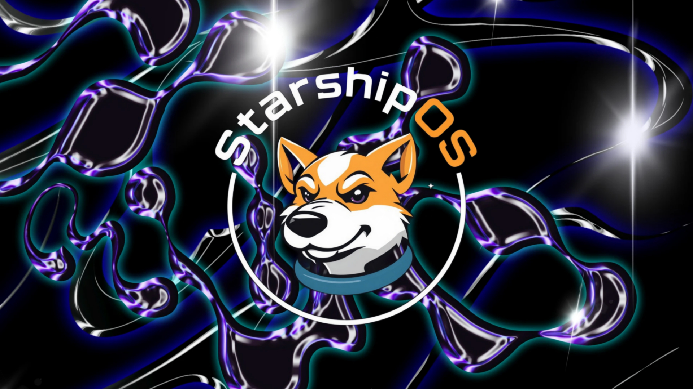

## [A Vision for Empowerment](doc/vision.md)

The **Starship Operating System** project is not just about technological innovation, but also about transformative
impact. With a strong belief in the untapped potential within the prison system, this project aspires to serve as an
educational platform, providing inmates with access to valuable programming skills. This endeavor recognizes the
importance of offering incarcerated individuals constructive outlets and opportunities to rebuild their lives. By
teaching modern software development skills within a supportive environment, StarshipOS seeks to empower those who often
feel voiceless, fostering rehabilitation and creating pathways to meaningful employment after release. This vision
underscores a commitment to harnessing talent, encouraging change, and, ultimately, leaving a meaningful mark on the
world.# Starship Operating System (StarshipOS). 

Welcome to the repository for **Starship Operating System**! This project aims to revolutionize traditional operating 
systems by integrating principles of object-oriented programming (OOP) deeply into the OS architecture, offering a 
modern way to manage files and memory.

## Table of Contents

- [A Different Way of Thinking](DIFFERENT_WAY.md)
- [For developers, very important!](IMPORTANT-README.md)
- [Project Vision](#project-vision)
- [Key Features](#key-features)
- [Project Structure](#project-structure)
- [Getting Started](#getting-started)
- [Technical Details](#technical-details)
- [Contributing](#contributing)
- [License](#license)

## Project Vision

Our vision is to create a state-of-the-art Operating System where every component, from files to memory management,
adheres to object-oriented principles. The OS will support running Java applications directly and provide an 
environment where `jshell` can be used interactively as early as possible during the boot process. Ultimately, 
the goal is to develop an object-oriented filesystem that utilizes virtual memory for enhanced performance 
and persistence.

## Key Features

- **Object-Oriented Filesystem**: Introducing a filesystem where every file and directory is represented as an
- object, making the system more modular, flexible, and extensible.
- **Virtual Memory Management**: Treating mass storage as virtual memory to efficiently handle active and dormant objects.
- **Java Integration**: Full support for Java runtime, enabling the use of `jshell` for dynamic scripting and interaction.
- **Persistence Control**: Implement mechanisms to flag specific objects for persistence, ensuring important data is always saved.

## Project Structure

```
StarshipOS/
├── busybox
│ ├── busybox
│ └── scripts
├── grub
│ └── scripts
├── initramfs
│ └── scripts
├── java
│ ├── jdk
│ └── scripts
├── live_cd
│ └── scripts
├── qcow2_image
│ ├── build
│ └── scripts
├── scripts
├── starship
│ ├── scripts
│ └── starship_kernel
├── starship-sdk
│ ├── scripts
│ └── src
├── system-bridge
│ ├── scripts
│ └── src
└── userland-java
    ├── scripts
    └── src
```

## Getting Started

### Prerequisites

- ``**sudo**`` ***is required!***
- **Build Environment**: Ensure you have a Linux build environment with necessary tools such as GCC, Make, etc.
- **Java Development Kit (JDK)**: Download and compile the source for Java JDK (version 23 as default).

### Building the Project

There are scripts to aid in building **StarshipOS**
In the root directory there is s directory called "scripts".
```build.sh```, this is what you are looking for to build **StarshipOS**.
Sit back and relax while it runs its course.

Each directory has a ``scripts``

### Important point: when running maven, build artefacts are placed in the ``build`` 
directory in the sub project **AND
NOWHERE ELSE**!!! [^1]

### Running `jshell`

Upon booting, the `init` script will set up the environment be launch `jshell`. This provides an interactive Java
environment immediately after the OS boots.
*(As of today, this does not happen yet.)*

## Technical Details

We will spin **StarshipOS** from the initial linux kernel. **Busybox** will be available should ```jshell``` not start.

1) **busybox** provides for different configurations. ``defconfig`` provides for just about everything but the kitchen
   sink.
   1) **busybox** may be reconfigured as needed using the Makefile in the busybox root directory (see ```make help```).

2) **grub** simply is a container to hold the ```grub.cfg``` file.
   1) **grub** fun fact: NO SHELL SCRIPT! The resources plugin takes care of that.

3) **initramfs** is where the ram disk is assembled.
   1) Look into the shell script for details.
4) **java** This is where the Java23 JDK is built.
   1) This JDK build is a minimal build with ``compiler1, compiler2 & zgc`` as the garbage collector.
   2) As with any of these modules you can reconfigure the java build.
5) **live_cd** is where the ISO image is built.
6) **starship** is the linux kernel we will rely on for hardware interaction and housekeeping.
   1) Again, this is a minimal build of the linux kernel and will probably be reconfigured as the project moves along.
### Object-Oriented Filesystem

The filesystem treats each file and directory as an instance of a `PersistentObject`. Objects are cached in virtual 
memory for quick access and persisted to storage as needed based on their flags:

## Contributing

We welcome contributions from everyone! Here’s how you can help:

1. Fork the repository and create your branch from `main`.
2. If you’ve added code that should be tested, add tests.
3. Create a pull request explaining the changes.

Please read our [Contributing Guidelines](docs/CONTRIBUTING.md) for more details.

## License

This project uses multiple licenses based on the component scope:

- **GPLv2**: Applied to Linux-related files in the project.
- **GPLv2-only**: Applied to Java files in the project.
- **Apache License 2.0**: Applied to all other original code and files.

For full license details, see the following files:

- [LICENSE_GNU2.md](LICENSE_GNU2.md) for GPLv2.
- [LICENSE_APACHE2.md](LICENSE_APACHE2.md) for Apache License 2.0.

SPDX-License-Identifier: Apache-2.0 OR GPL-2.0-only

---

Thank you for your interest in **My Object-Oriented Operating System**. We’re excited to push the boundaries 
of traditional OS design and create something truly modern and innovative. If you have any questions or need 
further assistance, feel free to reach out via our [issue tracker](https://github.com/your-repo/issues).

Why is this so important? The module will not be built if the build directory exists.

Happy Coding!
